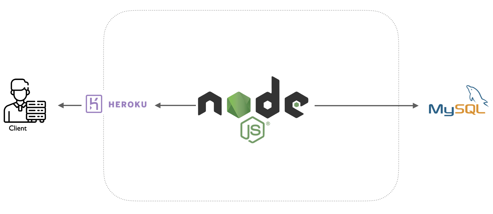
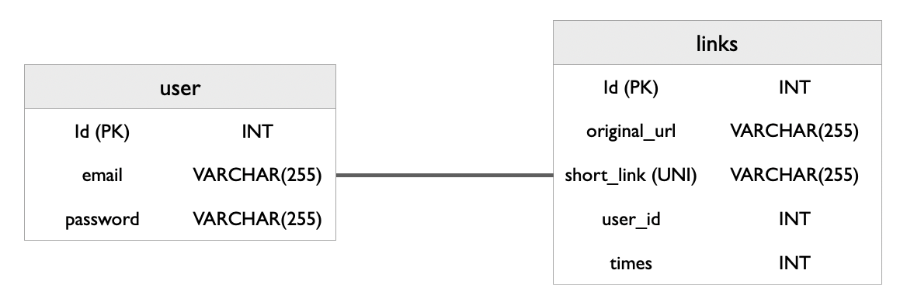

# shortLink_project

網站架設在Heroku。

網址：https://www.isho.xyz/

## 目錄 

<ul>
  <li><a href= #install>專案安裝</li>
  <li><a href= #requirement>滿足需求</li>
  <li><a href= #structures>網站架構</li>
  <li><a href= #database>資料庫設計</li>
  <li><a href= #feature>功能介紹</li>
</ul>

## 
專案安裝

<ul>
  <li>git clone https://github.com/HSIEH-J/shortLink_project/</li>
  <li>npm install</li>
  <li>建立.env檔案</li>
  <li>匯入資料庫short_links.sql</li>
</ul>

## 
滿足需求

框架版本

<ul>
  <li>Node.js / Expresss: v14.16.0</li>
  <li>React.js: v17.0.2</li>
</ul>

符合需求

<ul>
  <li>React App 使用 Functional Component</li>
  <li>EsLint</li>
  <li>網站架設在Heroku供公開瀏覽</li>
</ul>

## 
網站架構

## 
資料庫設計

## 
功能介紹

<ul>
  <li>短網址生成</li>
  
  <li>註冊、登入和登出</li>
  User can create folders to classify their bookmarks.
  <li>查看短網址點擊次數</li>
  User can create sticky notes to write remarks.
</ul>

